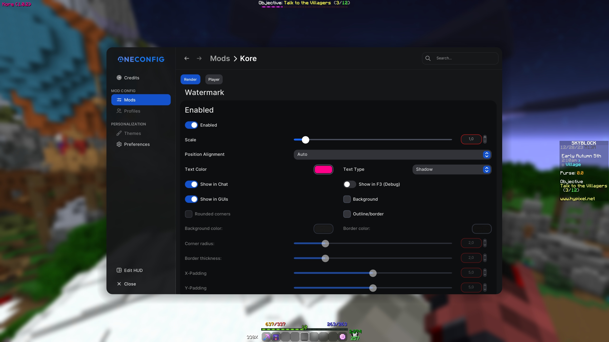
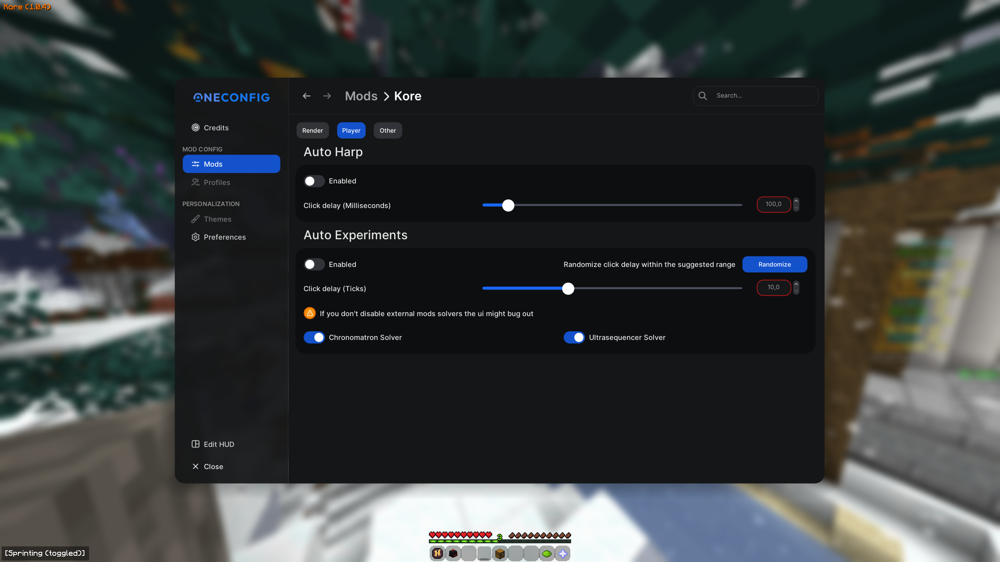
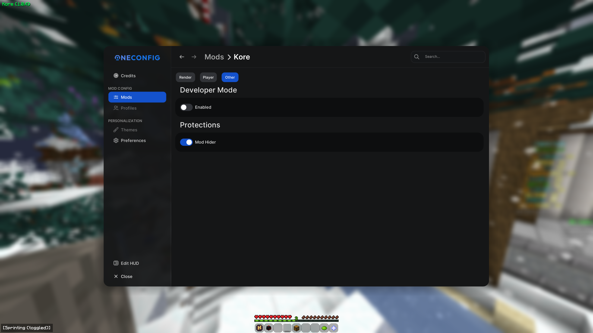

# Kore (1.0.4)

Kore is a forge 1.8.9 mod, kore goal is to automate simple skyblock annoying and repetitive tasks.

## Features

- Render 
  - Watermark
- Player
  - Auto Harp
  - Auto Experiments
- Other
  - DevMode (Debug)
  - Mod Hider

## Screenshots

## Contributing

Contributions are always welcome!

Create a feature for `Kore` and open a `Pull Request` with your code!

## FAQ

#### Is it bannable?

Yes.

#### Is it undetected?

Should be, use delays and you should be fine.

#### Is this a rat?

No, compile it yourself if you want.

