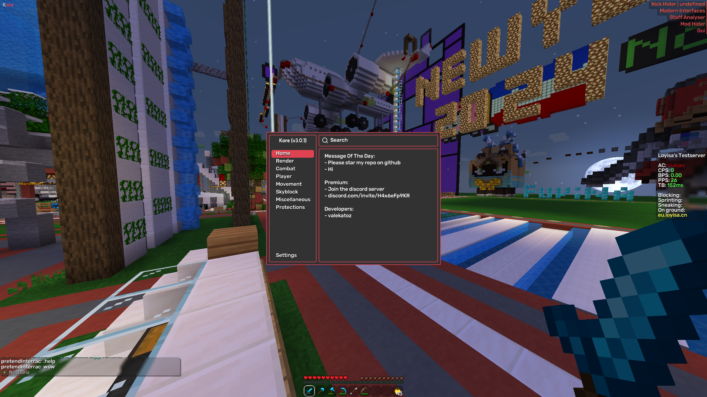
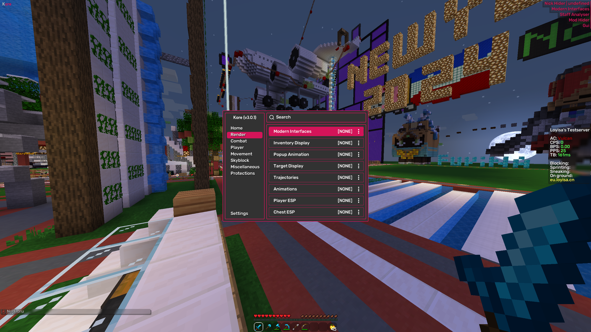
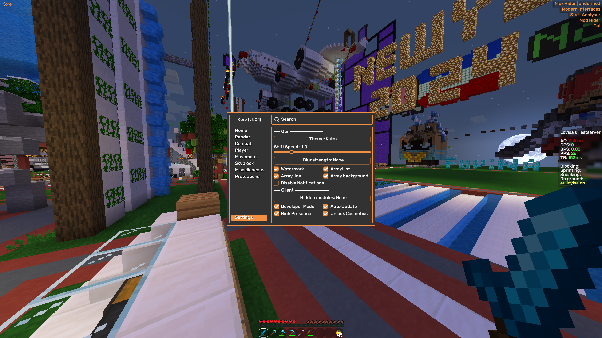
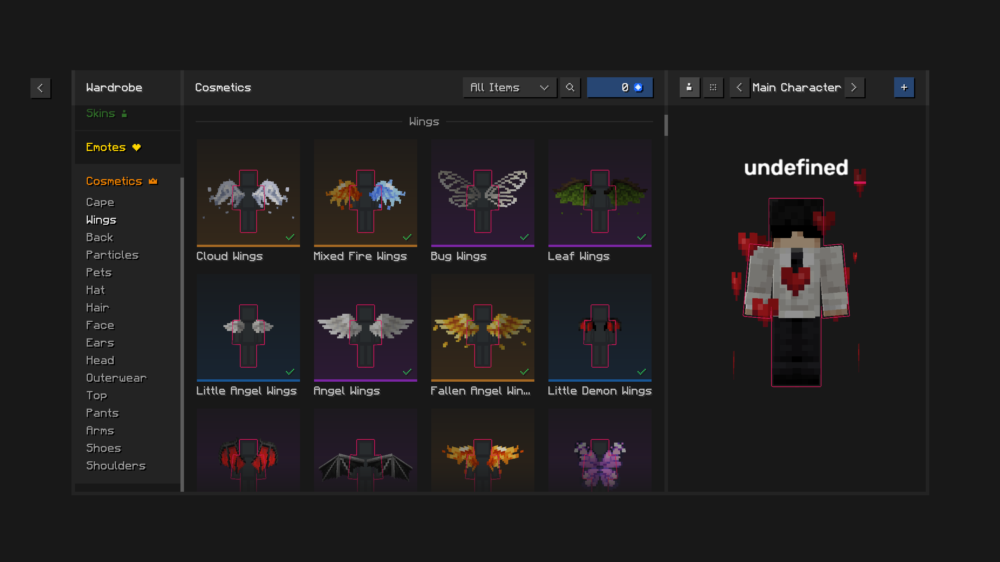

# Kore (v3.0.0)

Kore is a minecraft forge 1.8.9 mod, kore goal is to automate simple skyblock annoying and repetitive tasks while keeping you entertained with cool features. 
You can access the mod by using the default keybind (right shift).

> If you can't compile this yourself and wish to have the premium version [join the discord](https://discord.com/invite/H4x6eFp9KR), it's free.

## Screenshots
Home:

Render (Modules):

Client Settings:

Cosmetics Unlocker:

## Features

- Render
  - Modern Gui
  - Modern Interfaces
  - Inventory Display
  - Target Display
  - Nametags
  - Player ESP
  - Chest ESP
  - Popup Animations
  - Giant Models
  - Trajectories
  - Chinese Hat
  - Animations
  - Animator
  - Trail
- Player
  - Chest Stealer
  - Auto Tool
  - Fast Break
  - Fast Place
  - Velocity
  - FreeCam
- Movement
  - Bunny Hop
  - Safe Walk
  - Gui Move
  - NoSlow
- Combat
  - Kill Aura
  - Auto Clicker
  - Aim Assist
  - Anti Bot
- Skyblock
  - Ghost Blocks
  - **Purse Spoofer** (Premium)
  - Auto Experiments (Premium)
  - Auto Harp
  - End ESP
- Misc
  - Build Guesser
  - Murder Finder
  - Server Beamer
- Protections
  - Staff Analyzer
  - Proxy (Broken)
  - Mod Hider
  - Nick Hider
- Client
  - **Custom Apis**
  - **Custom License System**
  - **Discord Rich Presence**
  - **Auto Updater**
  - **Essential Cosmetics Unlocker**
  - Debug Mode

## Credits

- valekatoz
- Kyrotechnic (UI)
- dxxxxy (Essential Cosmetics Unlocker)

## FAQ

#### Is it bannable?

Yes.

#### Is it undetected?

Don't be stupid and you won't get banned.

#### Is this a rat?

No, compile it yourself if you want.

## Disclaimer
If this code is not in compliance with some licenses or something let me know opening a new issue.
