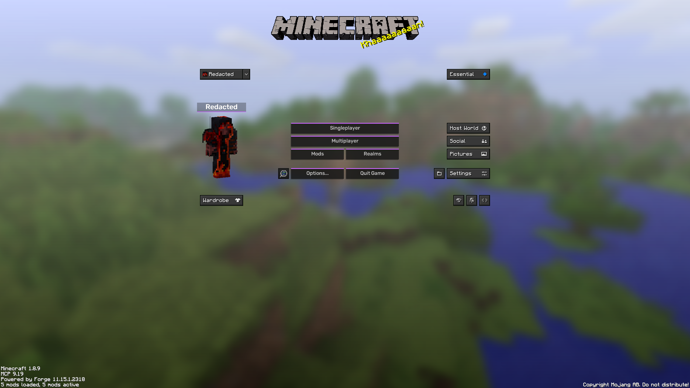
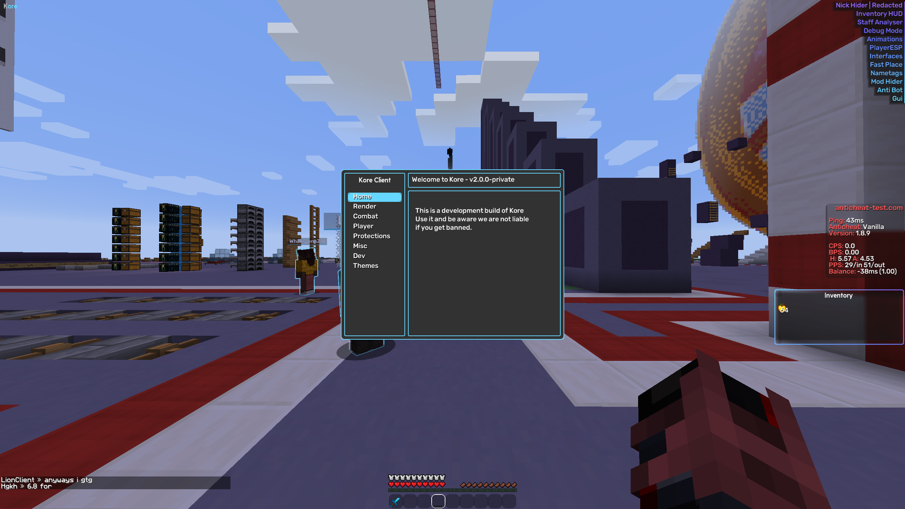

# Kore (2.0.1-private)

Kore is a minecraft forge 1.8.9 mod, kore goal is to automate simple skyblock annoying and repetitive tasks while keeping you entertained with cool features. 
You can access the mod by using the default keybind (right shift), to set a custom keybind hold shift and left click a module.

## Note

if this code is not in compliance with some licenses or something let me know opening a new issue.

## Features

- Render
  - Modern Gui
  - Modern Interfaces
  - Modern InventoryDisplay
  - Nametags
  - PlayerESP
  - PopupAnimations
  - Giant Models
  - Chinese Hat
  - Animations
  - **Essential Cosmetics Unlocker**
- Protections
  - Mod Hider
  - Nick Hider
  - Staff Analyzer
  - Proxy (WIP)
- Player
  - Fast Break
  - Fast Place
  - FreeCam
  - Inventory Move
  - Ghost Blocks
- Combat
  - AimAssist
  - AntiBot
- Misc
  - Auto Experiments
  - Auto Harp
  - Murder Finder
- Dev
  - Debug

## Screenshots

## Contributing

Contributions are always welcome!

Create a feature for `Kore` and open a `Pull Request` with your code!

## Credits

- valekatoz
- Kyrotechnic (UI)

## FAQ

#### Is it bannable?

Yes.

#### Is it undetected?

Some features are, render and misc are safe to use (remember to keep modhider enabled).

#### Is this a rat?

No, compile it yourself if you want.

